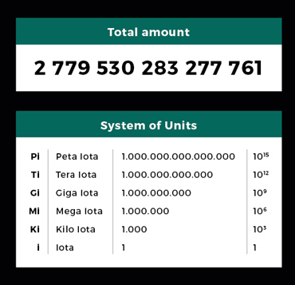

# IOTA Quickstart

## Introduction
This guide focuses on the following things:

- Getting you up and running fast
- Pitfalls you you **need** to know
- Best practices to keep you secure

When I started with IOTA, some things where quite confusing compared to other coins. A lot of people make mistakes that can end severely. Future wallets may take away some of the complexity. So do not worry, with this guide, the few things to know will take away all the possible struggles.

The goal of this guide is to be the entry point for all newcomers. It should set you up in the shortest way possible. :)

Note that everything you do is your own responsibility. I take no responsibility for anything that goes wrong.

## Setting up a wallet
Install the mobile or the desktop client. If your are asked for which kind of node you want to be, choose the light node option. Keep in mind, that only the desktop wallet is an "official" one, so if you plan to hodl long term, I suggest you go with that one.

- Desktop Wallets: https://github.com/iotaledger/wallet/releases
- Android Wallet: [Play Store](https://play.google.com/store/apps/details?id=org.iota.wallet)
- IOS Wallet: In progress...
- UCL Wallet: Coming soon...
- CLI Wallet with Multisignature support (by bitfinex): https://github.com/bitfinexcom/smidgen

You need a seed, which will act as your private key (like you know if from other coins). To generate a seed, you need to be extremely careful. Everyone will be able to steal your IOTAs if he/she knows this seed.

I suggest the following (since not all wallets generate seeds themselves):
- Generate a seed, [here is how](https://matthewwinstonjohnson.gitbooks.io/iota-guide-and-faq/getting-started/dl-wallet/what-is-my-seed.html). If you are using the mobile wallet, it can generate a seed for you. You can also search online for a seed generator, but do NEVER just plainly copy a seed like that, because it could be taken. It is highly recommended not to use an online service for that.
- I highly recommend to not just use the seed you get, but to change some of the characters by yourself. **This is a must if you generated the seed somewhere on an internet page!**

This is the safest and most easy to use method. Never attempt to generate a seed your own by just smashing that keyboard to 81 characters, because humans are bad rando generators.
You will use this seed to login to your wallet from now on.

## Backup
If you forget your seed, if you loose it during a computer crash and whatever, you are doomed. Your IOTAs will be gone forever. Therefore, Backups are highly recommended.

### Paperwallet
There are those fancy "IOTA Paperwallet Generator" websites. Do not trust them. Do not trust ANYONE about this. Another thing to consider: If a robber robs your house and he sees a paper on your Desk called "IOTA SEED PAPERWALLET - ULTRA SECURE!!!!1", he will definitely take it with him, so think twice if you really want to have everyone knowing what is going on on this sheet. I even suggest that you encrpyt this seed before you print it out. Somebody probably reads your printer or some of your "friends" may find it.

### Backup to the cloud
This may sound ridiculous, but I myself do that. I put the encrypted seed into a textfile and put this textfile into a 7z archive ([download 7zip here](http://7-zip.org/)). Remember: You need a very strong password for this archive. At least 20 characters, the more, the better. Anything that is into the cloud, other people can possibly access. And if no one has access to the cloud because your cloud account is super safe, be reminded that there are admins working on the cloud too.

Great, we are all set up now! :)

## Sending IOTA to someone
Sending IOTA is easy. If you need help, look here: [https://iotasupport.com/gui-sendingandreceiving.shtml](https://iotasupport.com/gui-sendingandreceiving.shtml)

**Important to know is, that you must not use and address to send IOTAs twice!** This can lead to losing your funds. If you do not need to choose the address you send the funds from, do not worry, that means that the wallet already does this for you. 

## Receiving IOTA from someone
Receiving IOTA is easy. If you need help, look here: [https://iotasupport.com/gui-sendingandreceiving.shtml](https://iotasupport.com/gui-sendingandreceiving.shtml)

There is nothing to consider here. You can receive as much transactions as you want on the same address, as long as you do not move your funds from there to somewhere else.

## Pitfalls
Here are some things to know (already covered in the other sections, but just to group them):

- NEVER use the same address twice to send IOTA.
- If you have a balance of 0, it might be that a tangle snapshot happened. Just recreate addresses until you see all of your balance.
- Create a backup of your seed! Check the Backup section for that.

## Terminology
You have probably read about things like "MIOTA" and stuff like that. Do not worry, that is not some kind of soft/hard-fork or whatever. MIOTA simply means "Million Iota", so 1 Mi == 1'000'000 IOTA. The image explains it:

## FAQ

### How can I buy IOTA?
You can get IOTA from [Bitfinex](https://bitfinex.com/) and [Binance](https://www.binance.com/).

I suggest that you buy ETH from another platform like [Kraken](https://www.kraken.com/), withdraw them to an ETH address on Bitfinex and and from there, trade your ETH to IOTA.

### My IOTA balance suddenly shows 0.
Just go to the 'Addresses' section and recreate your address until you see all of your IOTAs.

### The Bitfinex transaction to my wallet takes forever, should I cancel it?
Yes, just cancel it and reput your order, if it did not confirm after 1 hour.

### When I click "Attach Address to Tangle" or "Generate New Address", it takes forever, what can I do?
Try logging out and back into your wallet. If that still does not work, go to 'Tools', 'Edit node configuration' and chose 'CCurl implementation' under the 'Curl implementation' section.

## Disclaimer
I do not take responsibility for anything that is written here. If you somehow mess up anything and blame it on me, just know that you did everything here on your own responsibility.

Feel free to share and edit this document. The only restriction is, that you are not allowed copy it and set yourself as the author.
